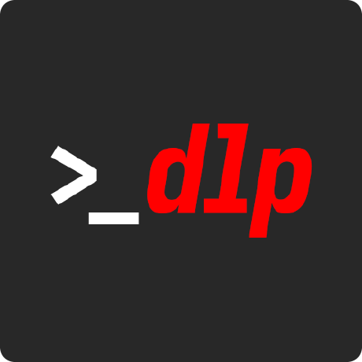

# MediaSlayer - Video Downloader

<p align="center">
  
</p>

<p align="center">
  A modern, user-friendly desktop application for downloading videos from YouTube, X (Twitter), and hundreds of other websites.
</p>

---

## 📝 Changelog / Recent Improvements

- **2024-06**: Major stability and UX improvements:
  - The Execute Download button is now always responsive—no more repeated clicks needed.
  - UI is much smoother, even for long downloads, thanks to batched log updates and throttled progress reporting.
  - Clear error dialogs now appear if a download fails, so you always know what went wrong.
  - Multiple downloads in a row work reliably without needing to restart the app.

## ✨ Features

- **Modern UI**: Clean, beautiful interface inspired by gaming aesthetics.
- **Broad Compatibility**: Supports hundreds of sites, powered by the robust `yt-dlp` engine.
- **Format Selection**: Choose between video (MP4, WebM) and audio-only (MP3, WAV) formats.
- **Quality Options**: Select your preferred video quality, from 360p up to 1080p.
- **Stable & Responsive**: UI remains fast and responsive, even for long downloads, thanks to multi-threading, batched log updates, and throttled progress reporting.
- **Reliable Download Button**: The Execute Download button always works—no more repeated clicks or freezes.
- **Clear Error Feedback**: If a download fails, you get a clear error dialog explaining why.
- **Cross-Platform**: Built with Python and Tkinter, it runs on macOS, Windows, and Linux.

## 🚀 Quick Start

#### 1. Prerequisites
- [Python 3.7+](https://www.python.org/downloads/)
- [ffmpeg](https://ffmpeg.org/download.html): Required for merging video and audio streams (especially for high-quality formats). The easiest way to install it is with a package manager like Homebrew on macOS (`brew install ffmpeg`) or Chocolatey on Windows (`choco install ffmpeg`).

#### 2. Installation
Clone the repository and install the required Python packages:
```bash
git clone https://github.com/your-username/video-downloader.git # Please replace with the actual URL
cd video-downloader
pip install -r requirements.txt
```

#### 3. Running the Application
Launch the app from the root directory of the project:
```bash
python -m mediaslayer.main
```

## 🎮 How to Use

1.  **Paste URL**: Paste a video URL from a supported platform (YouTube, X, etc.).
2.  **Choose Options**: Select your desired format and quality.
3.  **Download**: Click "Execute Download Quest"—the button is always responsive, and you'll see instant progress and logs.
4.  **Error Handling**: If something goes wrong, a clear error dialog will appear.
5.  **Find Your File**: The downloaded media will appear in your system's "Downloads" folder.

## 🛠️ Project Structure

The project was refactored into a modular architecture to separate concerns and improve maintainability.

```
video-downloader/
├── mediaslayer/              # Main application package
│   ├── ui/                   # User Interface modules
│   │   ├── main_window.py    # - Defines the main window layout and widgets
│   │   └── styles.py         # - Configures the custom ttk styles
│   ├── services/             # Background services
│   │   └── downloader.py     # - Handles all yt-dlp logic and threading
│   ├── app.py                # - Core application class, orchestrates UI and services
│   └── main.py               # - Main entry point for the application
├── assets/                   # Icons and other static assets
├── icons/                    # App icon PNGs and .icns
├── packaging/                # All build/packaging scripts and spec file
│   ├── MediaSlayer.spec      # PyInstaller spec file (macOS)
│   ├── build_app.sh          # Bash build script (macOS)
│   ├── build_macos_app.py    # Python build script (macOS)
│   └── create_icon.py        # Icon generator script
├── dist/                     # Output folder for built apps
├── venv/                     # (Optional) Python virtual environment
├── README.md                 # This file
└── requirements.txt          # Python dependencies
```

## 📦 Building a Standalone App (macOS)

All macOS build and packaging logic now lives in the `packaging/` folder. You no longer need to run or edit build scripts from the project root.

### 1. Prerequisites
- Python 3.7+ (recommended: 3.11 or newer)
- [ffmpeg](https://ffmpeg.org/download.html) (install via Homebrew: `brew install ffmpeg`)
- (Recommended) Create and activate a virtual environment:
  ```bash
  python3 -m venv venv
  source venv/bin/activate
  pip install -r requirements.txt
  ```

### 2. Build the macOS App
From the project root, run:
```bash
# Bash build (recommended for most users)
./packaging/build_app.sh

# Or, Python build helper (for advanced/CI use)
python packaging/build_macos_app.py
```
- The app bundle will appear in `dist/MediaSlayer.app`.
- If you want to install it system-wide:
  ```bash
  cp -R dist/MediaSlayer.app /Applications/
  ```
- To create a DMG for distribution, use the Python build script (it will prompt or create one automatically).

### 3. Customizing the Build
- To change the app icon, edit or regenerate with `python packaging/create_icon.py`.
- To change packaging logic, edit files in `packaging/` only.
- The PyInstaller spec file is now at `packaging/MediaSlayer.spec` and is path-agnostic.

### 4. Cleaning Up
- Temporary build artifacts are in `build/` and `dist/` (except for the final `.app`).
- You can safely delete `build/`, `dist/MediaSlayer` (not `.app`), and `__pycache__/` at any time.

## 🙏 Acknowledgments

-   **yt-dlp**: The powerful and versatile engine that makes this application possible.
-   **Python/Tkinter**: For the native, cross-platform GUI framework.
-   **PyInstaller**: For creating standalone application bundles.

## Project Structure

```
youtube/
├── src/                          # Main source code
│   ├── media_downloader_gui.py   # Main GUI application
│   └── mediaslayer_launcher.pyw  # Silent launcher (no console)
├── assets/                       # Icons and images
│   ├── icone.png                 # Main icon (PNG)
│   ├── icone.ico                 # Windows icon (ICO)
│   ├── mediaslayer.ico           # Legacy icon
│   └── interface-imagem.png      # Interface screenshot
├── scripts/                      # Utility scripts
│   └── create_shortcut.py        # Creates Windows desktop shortcut
├── legacy/                       # Old/deprecated files
│   ├── configurar_execucao_silenciosa.py
│   ├── executar_mediaslayer.bat
│   └── executar_mediaslayer_silencioso.bat
├── downloads/                    # Default download location
├── run.py                        # Main launcher script
├── requirements.txt              # Python dependencies
└── README.md                     # This file
```

## Quick Start

1. **Install dependencies:**
   ```bash
   pip install -r requirements.txt
   ```

2. **Run the application:**
   ```bash
   python run.py
   ```

3. **Create desktop shortcut (Windows):**
   ```bash
   python scripts/create_shortcut.py
   ```

## Windows Shortcut notes

The `scripts/create_shortcut.py` utility automatically:

1. Locates `pythonw.exe` (falls back to `python.exe` if not found).
2. Points the shortcut to `run.py` so the GUI opens exactly like `python run.py`.
3. Uses `assets/icone.png` → `icone.ico` as the icon (it will convert on first run – requires Pillow).
4. Places `MediaSlayer.lnk` on your desktop.

If you change the icon, just replace `assets/icone.png` and rerun the shortcut script.

> **Tip**  –  If the shortcut fails to launch, right-click → Properties and confirm:
> * Target:  `"…pythonw.exe" "…\run.py"`
> * Start in: project root (same folder that contains `run.py`).

## Dependency notes

`yt-dlp`, `tkinter` and `Pillow` are platform-independent.
`pywin32` and `winshell` are only used for Windows-specific features (shortcut creation). On macOS/Linux you can omit them or safely ignore errors related to shortcut scripts.

## Features

- Clean, modern interface optimized for small screens
- Support for YouTube and X (Twitter) downloads
- Multiple format options (MP4, MP3, WebM, WAV)
- Quality selection (1080p, 720p, 480p, 360p)
- Real-time download progress
- Silent execution (no console window)
- Automatic platform detection

## Usage

1. Enter a video URL in the input field
2. Select your preferred format and quality
3. Choose download location (optional)
4. Click "Execute Download Quest" to start

## Supported Platforms

- YouTube (youtube.com, youtu.be)
- X/Twitter (x.com, twitter.com)
- Many other platforms supported by yt-dlp

## Requirements

- Python 3.7+
- Windows (for desktop shortcut creation)
- Internet connection

## Dependencies

- `yt-dlp` - Video downloading engine
- `tkinter` - GUI framework (included with Python)
- `pywin32` - Windows integration
- `winshell` - Windows shell operations
- `Pillow` - Image processing for icons

## License

This project uses yt-dlp for video downloading. Please respect the terms of service of the platforms you download from. 